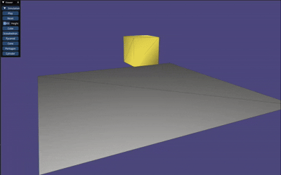
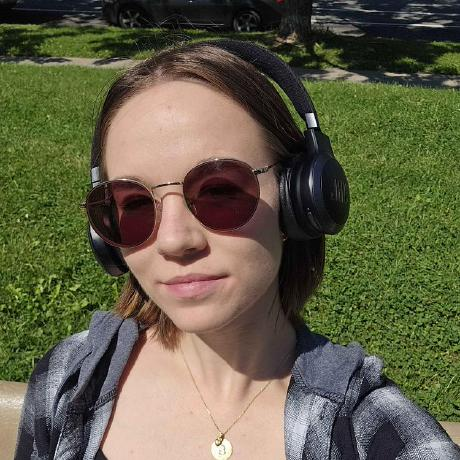

<p align="center">
  
</p>

****

# Table of contents
- [Context](#context)
- [Description](#description)
- [Implementation](#implementation)
  - [Requirements](#requirements)
  - [Hierarchy](#hierarchy)
  - [Compilation](#compilation)
  - [Run](#run)
  - [Controls](#controls)
- [Challenges](#challenges)
- [Gallery](#galery)
- [Author](#author)

****

## Context
As a game development enthusiast, I chose this project because it bridges geometric modeling and processing with game development—two areas that align with my goal of working in the industry.
For my final-year project, my team and I are building a game engine in **C++**, so I wanted to explore a topic that would complement that experience while also challenging me in new ways.

As you probably already know, most game engines use rigid body physics to simulate solid objects that don’t deform. But here I want to pay attention on soft-body physics, use for realistic visualisations such as simulating jelly, that requires additional techniques to model elasticity and deformation.
This project allows me to gain hands-on experience with soft-body dynamics, which are essential for creating realistic physics-based interactions.

Additionally, by choosing this topic, I wanted a highly visual result that would be easy to showcase and serve as a strong portfolio piece. This project was also a great opportunity to learn and work with a new library: **Libigl**.

> Note that this project is a student project for educational purposes and to demonstrate the principles of soft-body simulation. It may not be perfect and contains bugs and limitations.

### The main objectives of this project are:
### **> Generate Primitive Meshes:** 
Create and render basic geometric primitives (cube, sphere, pyramid, cone, cylinder…) that will serve as the foundation for the soft-body simulation.

### **> Implement a Mass-Spring System:**
In this project you can find the implementation a mass-spring system used for physics-based deformation like soft objects (like jelly objects).

### **> Implement a User Interface:**
The user can control the simulation with a simple and intuitive interface that enables to play/pause/reset the simulation, change the model used, its height, and switch between different shapes.

### **> Custom Model Importation:**
This project allows the user to import their own 3D models (.obj, .off) by specifying the path of the file as an argument of the binary command. This feature enhances the flexibility and usability of the simulation, allowing users to experiment with different shapes and designs.

****

# Description

Jelly Simulation is a simulation project that models the behavior of different jelly objects.

The project is developed in C++ using libigl and focuses on simulating various 3D meshes, including cubes, icosahedrons, pyramids, pentagons, cones, and cylinders.

The user can import a custom model by specifying the path of a `.obj` or `.off` file as an argument of the binary command. Once the viewer is launched, users can control the simulation through a menu developed with ImGui, which provides options to start and pause the simulation, reset the scene, modify the model’s height, and switch between available models.

The viewer also supports camera movement, allowing users to rotate the view and navigate the scene freely.

When the simulation starts, the selected model falls under gravity, and the mass-spring system is applied to each edge to compute spring forces. This simulates a jelly-like deformation, making the model bounce and deform upon impact with the ground in a realistic manner.

****

## Implementation
### Requirements
This project is implemented in C++ and uses the following libraries:
- [libigl](https://libigl.github.io/) for geometry processing and rendering.
- [ImGui]() for the graphical user interface.
- [Eigen](https://eigen.tuxfamily.org/dox/GettingStarted.html) for linear algebra operations.
- [GLFW](https://www.glfw.org/) for window management and input handling.

The source code of this project can be found on [GitHub](https://github.com/Sauterelle57/Jelly-Simulation).

### Hierarchy

The project structure is organized as follows:

```
JellySimulation/
├── README.md
├── CMakeLists.txt
├── src/
│   ├── generation.cpp
│   ├── main.cpp
│   ├── menu.cpp
│   ├── simulation.cpp
│   └── sources.hpp
├── cmake/
│   └── libigl/
├── models/
│   ├── cone.obj
│   ├── format_obj.py
│   └── pyramid.obj
├── build/
└── assets/
    ├── web/
    │   ├── pp.gif
    │   └── jelly.gif
    ├── cube.gif
    ├── icosahedron.gif
    ├── cone.gif
    ├── cylinder.gif
    ├── pyramid.gif
    └── pentagon.gif
```

- `README.md`: This file, containing the project documentation.
- `CMakeLists.txt`: The CMake configuration file for building the project.
- `src/`: Directory containing the source code files.
- `cmake/`: Directory containing the library headers.
- `models/`: Directory containing examples .obj and a python script to formate a .obj file into a clean .obj readable by libigl.
- `build/`: Directory where the project is built.
- `assets/`: Directory containing image assets used in the gallery section and web page.

## Compilation

Compile this project using the standard cmake routine:

    mkdir build
    cd build
    cmake ..
    make

This should find and build the dependencies and create a `JellySimulation` binary.

> Note that for development purposes, you can use `make -j10` (or any number of cores you have available on your machine, depending on your CPU) to speed up can adjust it according to your needs. You can also use `cmake -GNinja ..` during the building of the project to speed up the compilation process.

## Run

From within the `build` directory execute the command:

    ./JellySimulation [model_path]

Where `model_path` is the path to a `.obj` or `.off` file. If no model is specified, the program will use a default cube model.

## Controls

The simulation can be controlled using the following keyboard and mouse controls:

- `Left Mouse Button`: Rotate the camera.
- `Right Mouse Button`: Move the scene.
- `A`: Play/Pause the simulation.
- `R`: Reset the simulation to its initial state.

You can also control the simulation using the GUI:

- `Play/Pause`: Play/Pause the simulation.
- `Reset`: Reset the simulation to its initial state.
- `Height`: Adjust the height of the model.
- `Cube`: Set the jelly shape to a cube.
- `Icosahedron`: Set the jelly shape to an icosahedron.
- `Cone`: Set the jelly shape to a cone.
- `Cylinder`: Set the jelly shape to a cylinder.
- `Pentagon`: Set the jelly shape to a pentagon.
- `Pyramid`: Set the jelly shape to a pyramid.

****
# Challenges
## The main challenges I faced during the development of this project were:
### **> Setup the project**
Initially, I tried to manually create the CMakeList file, but I couldn’t figure how to make it work. My first attempt was on Windows, like during the lab session. But after explaining my issues to the TA, he advised me to try with Ubuntu, and to reused the configuration of the tutorial example. But even after doing that, the compilation process was very slow. After some research, I discovered that using Ninja with the -J flag significantly improves build times. 
### **> Mass-spring system implementation**
Surprisingly, I didn’t have too much trouble implementing the mass-spring system. Perhaps this was because it was the part I was the most scared about, so I anticipated the challenges and prepared well by researching detailed explanations of how it works.
### **> Unstable simulation parameters**
Finding the right values for stiffness, damping, and speed was difficult because the simulation was highly sensitive to small changes and was heavily dependent on the model used. I first wanted to allow the user to adjust these parameters but it would likely make the simulation unstable and negatively impact the experience. I preferred to keep them as constants but suggested more model examples. 
### **> Usage of a global structure**
I needed a way to maintain global data without passing multiple parameters across functions. Finding the right approach took time and experimentation in order to keep a clean code structure that would allow me to easily add features and continue my development. The singleton design pattern was the right option in my case Even if I needed to rework it twice before my final version.
### **> .Obj files made with Blender**
I try to use Blender to create my own models to test them in my Jelly Simulator, but the .obj file generated by Blender contains texture coordinates and normal information stored on faces, and libigl’s .obj parser does not support this format. To work around the problems and correctly load the custom models, I then created a python script allowing me to delete unnecessary data and correctly reformat the file. 
### **> Usage of ImGui’s Gizmo tool**
I spent several days trying to integrate ImGui’s Gizmo but couldn’t get it to work. After multiple failed attempts, I decided to use keyboard, mouse inputs, and a user menu to make the simulation interactive instead of the Gizmo I originally wanted to use.
### **> Argument parsing / Menu**
These parts were the easiest since I was already familiar with C++ and had previous experience with ImGui. Because I understood how it works, I was able to create the menu and parse the model path quickly enough to avoid any impact on my development schedule for this project.
### **> Time constraints**
Even if the deadline was at the end of the term, I took too much time to choose and start the project and probably underestimated the time needed for this project. My optimism led me to procrastinate on this project, thinking I could complete it in less time than I actually needed. As a result, I focused too much on other assignments and projects that were due earlier. In the end, balancing this project with others during the end-of-term rush was challenging, I struggled to find enough time to work efficiently, which added extra pressure during the development. 

****
# Galery

### With a `Cube` at `height = 2.0`



### With a `icosahedron` at `height = 2.0`


### With a `pyramid` at `height = 2.0`


### With a `cone` at `height = 2.0`


### With a `pentagon` at `height = 2.0`


### With a `cylinder` at `height = 2.0`


****

## Author

<p>
  
    <br>
    <strong><a href="https://www.linkedin.com/in/marie-giacomel/">Marie Giacomel</a></strong>
</p>

Student at Epitech and Concordia University, passionate about computer science and understanding how things work. This project was developed as part of my studies at Concordia University during Winter 2025.

Thank you for reading! Enjoy your Jelly simulations!
