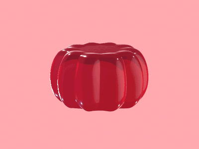

<p align="center">
  
</p>

****

# Table of contents
- [Description](#description)
- [Implementation](#implementation)
  - [Requirements](#requirements)
  - [Hierarchy](#hierarchy)
  - [Compilation](#compilation)
  - [Run](#run)
  - [Controls](#controls)
- [Challenges](#challenges)
- [Gallery](#galery)
- [Author](#author)

****

# Description

Jelly Simulation is a simulation project that models the behavior of different jelly objects.

The project is developed in C++ using libigl and focuses on simulating various 3D meshes, including cubes, icosahedrons, pyramids, pentagons, cones, and cylinders.

The user can import a custom model by specifying the path of a `.obj` or `.off` file as an argument of the binary command. Once the viewer is launched, users can control the simulation through a menu developed with ImGui, which provides options to start and pause the simulation, reset the scene, modify the model’s height, and switch between available models.

The viewer also supports camera movement, allowing users to rotate the view and navigate the scene freely.

When the simulation starts, the selected model falls under gravity, and the mass-spring system is applied to each edge to compute spring forces. This simulates a jelly-like deformation, making the model bounce and deform upon impact with the ground in a realistic manner.

****

## Implementation
### Requirements
This project is implemented in C++ and uses the following libraries:
- [libigl](https://libigl.github.io/) for geometry processing and rendering.
- [ImGui]() for the graphical user interface.
- [Eigen](https://eigen.tuxfamily.org/dox/GettingStarted.html) for linear algebra operations.
- [GLFW](https://www.glfw.org/) for window management and input handling.

The source code of this project can be found on [GitHub](https://github.com/Sauterelle57/Jelly-Simulation).

### Hierarchy

The project structure is organized as follows:

```
JellySimulation/
├── README.md
├── CMakeLists.txt
├── src/
│   ├── generation.cpp
│   ├── main.cpp
│   ├── menu.cpp
│   ├── simulation.cpp
│   └── sources.hpp
├── cmake/
│   └── libigl/
├── models/
│   ├── cone.obj
│   ├── format_obj.py
│   └── pyramid.obj
├── build/
└── assets/
    ├── cube.gif
    ├── icosahedron.gif
    ├── cone.gif
    ├── cylinder.gif
    ├── pyramid.gif
    └── pentagon.gif
```

- `README.md`: This file, containing the project documentation.
- `CMakeLists.txt`: The CMake configuration file for building the project.
- `src/`: Directory containing the source code files.
- `cmake/`: Directory containing the library headers.
- `models/`: Directory containing examples .obj and a python script to formate a .obj file into a clean .obj readable by libigl.
- `build/`: Directory where the project is built.
- `assets/`: Directory containing image assets used in the gallery section.

## Compilation

Compile this project using the standard cmake routine:

    mkdir build
    cd build
    cmake ..
    make

This should find and build the dependencies and create a `JellySimulation` binary.

> Note that for development purposes, you can use `make -j10` (or any number of cores you have available on your machine, depending on your CPU) to speed up can adjust it according to your needs. You can also use `cmake -GNinja ..` during the building of the project to speed up the compilation process.

## Run

From within the `build` directory execute the command:

    ./JellySimulation [model_path]

Where `model_path` is the path to a `.obj` or `.off` file. If no model is specified, the program will use a default cube model.

## Controls

The simulation can be controlled using the following keyboard and mouse controls:

- `Left Mouse Button`: Rotate the camera.
- `Right Mouse Button`: Move the scene.
- `A`: Play/Pause the simulation.
- `R`: Reset the simulation to its initial state.

You can also control the simulation using the GUI:

- `Play/Pause`: Play/Pause the simulation.
- `Reset`: Reset the simulation to its initial state.
- `Height`: Adjust the height of the model.
- `Cube`: Set the jelly shape to a cube.
- `Icosahedron`: Set the jelly shape to an icosahedron.
- `Cone`: Set the jelly shape to a cone.
- `Cylinder`: Set the jelly shape to a cylinder.
- `Pentagon`: Set the jelly shape to a pentagon.
- `Pyramid`: Set the jelly shape to a pyramid.

****
# Galery

### With a `Cube` at `height = 2.0`


> That's one small cube for man, on giant leap for Jelly-kind!

### With a `icosahedron` at `height = 2.0`


> This one is my favorite! :)

### With a `pyramid` at `height = 2.0`


> Even ancient structures can wiggle!

### With a `cone` at `height = 2.0`


> Not the most impressive one, but it works!

### With a `pentagon` at `height = 2.0`


> Because why not?

### With a `cylinder` at `height = 2.0`


> Sooo satisfying to watch!

****

## Author

<p>
  
    <br>
    <strong><a href="https://www.linkedin.com/in/marie-giacomel/">Marie Giacomel</a></strong>
</p>

Student at Epitech and Concordia University, passionate about computer science and understanding how things work. This project was developed as part of my studies at Concordia University during Winter 2025.

Thank you for reading! Enjoy your Jelly simulations!
